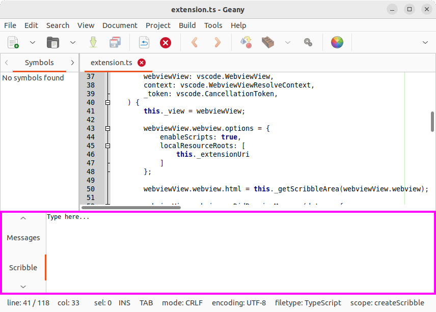
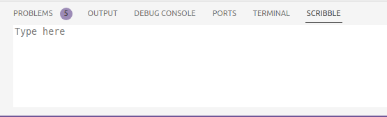

# Scribble

Take notes in VS Code, just like in the [Geany IDE](https://www.geany.org/):



This extension adds a (bottom) panel to the VS Code UI that mimics the functionality of Geany's "Scribble" feature:



## Why?

Because it's a neat little feature that I've been missing in VS Code after switching over from Geany. And apparently I'm not the only one: https://github.com/Microsoft/vscode/issues/58774

## Commands

Currently, the plugin exposes the following command(s):

Command | Description
--- | ---
`Save scribble` | Save scribble contents to disk

## Building from source

```sh
git clone https://github.com/lorenzgillner/vscode-scribble
cd vscode-scribble
npm install      # install dependencies
npm run release  # build the VSIX package
```
