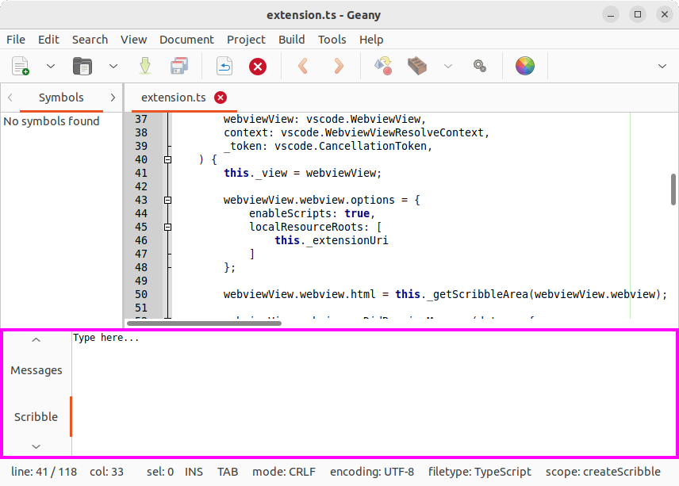
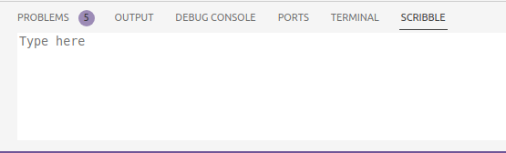

# Scribble

Take notes in VS Code*, just like in the [Geany IDE](https://www.geany.org/):



This extension adds a panel that mimics the functionality of Geany's "Scribble" feature:



## Build

To build this extension, you need the TypeScript compiler `tsc` and the "Visual Studio Code Extensions" (`vsce`) command line tool, which can be installed via `npm`:

```sh
npm install -g typescript @vscode/vsce
```

I recommend compiling the project first, to see whether you need to install some dependencies:

```sh
cd vscode-scribble
npm run compile
```

If everything compiles, you can package the current version:

```sh
vsce package # produces scribble-<version>.vsix
```

## Install

Build or download the package, then install it via "View" > "Extensions" > "Views and More Actions..." > "Install from VSCIX...", or from the command line:

```sh
code --install-extension scribble-<version>.vsix
```

## PSA

Don't forget to add `.scribble.txt` to your `.gitignore` if you are using a local scribble file; you probably don't want your notes to end up in some public repo 🫠